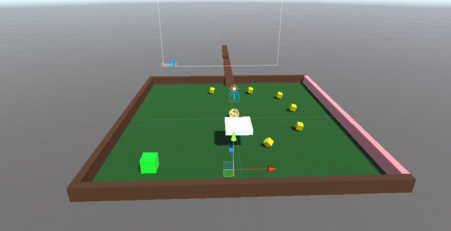

# Roll-A-Ball Extended (VR)
 Implemented roll-a-ball game on VR with some extended features such as :
 * Moving ball using VR controller
 * Collecting points
 * More graphics
 * Gravity effect
 * Jumping effects
 * Bouncer effect
 
## Resources
* [Roll-A-Ball Project](https://learn.unity.com/project/roll-a-ball-tutorials) - Project details

## Screenshot
 
 
